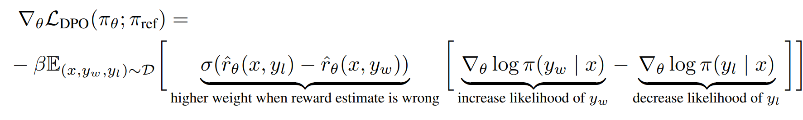
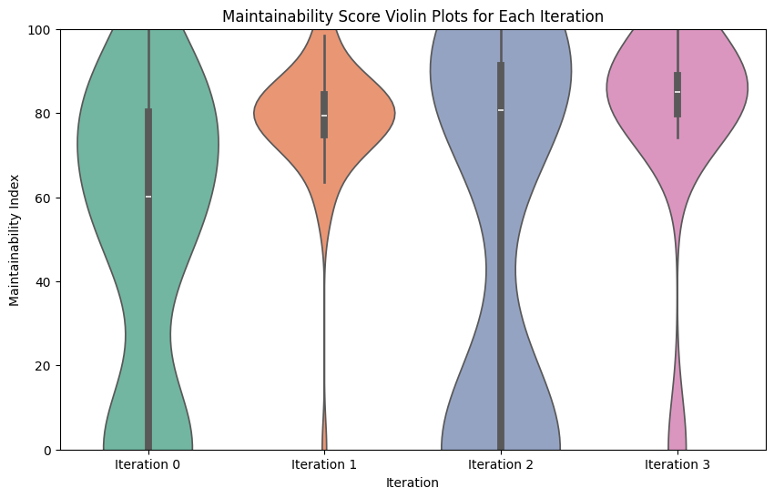

# Report on Python code maintainability index (MI) improvement using LLMs project

## Introduction

The project was performed as a part of Reinfocement Learning course at Innopolis University in April 2024 by the follwoing team:
* Daniil Arapov,
* Georgy Andryushchenko.

### Background for software metrics research

Software metrics are quantitative measures that provide insights into various aspects of software development, including code quality, complexity, and maintainability. These metrics play a crucial role in assessing the health of software projects, identifying areas for improvement, and making informed decisions about code maintenance and refactoring. Those metrics could be used by the managers or technical leaders to guide the software development based on solid quantitative metrics.  

One of the basic yet popular family of metrics was proposed back in January 1977 by Maurice Halstead [1], those metrics are well-known as Halstead's metrics, and numerous modern metrics rely on them, or at least their authors have known those base metrics.

Another popular metric called Cyclomatic Complexity was proposed by Thomas J. McCabe in December 1976 [2], this one is used to measure the complexity level of a specific code module, indicating if it should be further decomposed into separate submodules to ensure its maintainability.

Taking a step furter to software development guidance, Don Coleman *et al* proposed a Maintainability Index (MI) metric in 1994 [3]. This metric direct goal is to combine several other metrics to form a fair estimation of module maintainability. Further this metric was refined by other authors and currently it is a widely-used metric.

**REFERENCES**

[1] - **Halstead, M. H. (1977).** *Elements of Software Science (Operating and programming systems series). Elsevier Science Inc..*  
[2] - **McCabe, T. J. (1976).** *A complexity measure. IEEE Transactions on software Engineering, (4), 308-320.*  
[3] - **Coleman, D., Ash, D., Lowther, B., & Oman, P. (1994).** *Using metrics to evaluate software system maintainability. Computer, 27(8), 44-49.*

### Background for LLM alignment research (PEFT, RLHF)

Recent advancements in natural language processing and machine learning have led to the development of Large Language Models (LLMs) [1, 2, 3] capable of understanding and generating human-like text. Significant research has been devoted to aligning LLMs with specific tasks and domains to improve their performance. Alignment usually is perfomed as a last step after the supervised pre-training on a huge volume of data, usually followed by Parameter-Efficient Fine-Tuning (PEFT) [4, 5] allowing to rapidly and cost-effectively adopt LLM for a specific domain. Finally, comes the Reinforcement Learning from Human Feedback (RLHF) [6, 7] stage, when we assume that the model has all the necessary knowledge for the valid generation, and we aim to correct the generation format. In this scenario LLM is considered as an agent, user prompt (previous text) is considered as an environment and an action is a generation of a specific token. Reward is usually a human feedback given in some form: it could be either grade of an answer, or simply "like" or "dislike". Sometimes more elegent options such as "textual feedback" are applied. Human feedback is given for the already generated answer (sequence of agent actions), therefore one of the complexities is how to distribute the reward among the sequence of actions.  

Original RLHF methods [such as actor-critic-based Proximal Policy Optimization (PPO)] [6] have trained a reward model based on the human feedback and then used this model as a critic, to train actor generating the most likeable answers. However, the problem of that approach is that we need to train an additional model, that leads to additional biases as the model is biased. Therefore, new family of reward-oriented RLHF methods was proposed, that is a Direct Preference Optimisation (DPO) technique [7].

For DPO-like methods, user should rate two answer (sequences of actions), inidicating which one is preffered. After that, DPO modifies LLM weights (policy) so that probability of preffered answer (sequence of actions) is increased simultaneously with descrease of  rejected answer (sequence of actions). For the DPO-like methods policy correction is evenly distributed among the actions. DPO does not require an additional critique model and focuses only on the actual human feedback, ensuring the alignment correctness.




**REFERENCES**

[1] - **Brown, T., Mann, B., Ryder, N., Subbiah, M., Kaplan, J. D., Dhariwal, P., ... & Amodei, D. (2020).** *Language models are few-shot learners. Advances in neural information processing systems, 33, 1877-1901.*  
[2] - **Touvron, H., Lavril, T., Izacard, G., Martinet, X., Lachaux, M. A., Lacroix, T., ... & Lample, G. (2023).** *Llama: Open and efficient foundation language models. arXiv preprint arXiv:2302.13971.*  
[3] - **Bi, X., Chen, D., Chen, G., Chen, S., Dai, D., Deng, C., ... & Zou, Y. (2024).** *Deepseek llm: Scaling open-source language models with longtermism. arXiv preprint arXiv:2401.02954.*  
[4] - **Hu, E. J., Shen, Y., Wallis, P., Allen-Zhu, Z., Li, Y., Wang, S., ... & Chen, W. (2021).** *Lora: Low-rank adaptation of large language models. arXiv preprint arXiv:2106.09685.*  
[5] - **Li, X. L., & Liang, P. (2021).** *Prefix-tuning: Optimizing continuous prompts for generation. arXiv preprint arXiv:2101.00190.*  
[6] - **Schulman, J., Wolski, F., Dhariwal, P., Radford, A., & Klimov, O. (2017).** *Proximal policy optimization algorithms. arXiv preprint arXiv:1707.06347.*  
[7] - **Rafailov, R., Sharma, A., Mitchell, E., Manning, C. D., Ermon, S., & Finn, C. (2024).** *Direct preference optimization: Your language model is secretly a reward model. Advances in Neural Information Processing Systems, 36.*

### Background for code refactoring using AI

Specifically pre-trained code-domain LLMs [1, 2] are usually applied just for the code generation purposes, although code maintainance is one of the most time-consuming activities. Although it could be considered as a specific case of code generation, there are special papers aiming at code refactoring, for example fixing issues found by static code analyzer [3] and others. However, to the best of our knowledge, currently there are no papers specifically aiming at improvement of specific software metric, that is a significant research gap.

**REFERENCES**

[1] - **Roziere, B., Gehring, J., Gloeckle, F., Sootla, S., Gat, I., Tan, X. E., ... & Synnaeve, G. (2023).** *Code llama: Open foundation models for code. arXiv preprint arXiv:2308.12950.*  
[2] - **Guo, D., Zhu, Q., Yang, D., Xie, Z., Dong, K., Zhang, W., ... & Liang, W. (2024).** *DeepSeek-Coder: When the Large Language Model Meets Programming--The Rise of Code Intelligence. arXiv preprint arXiv:2401.14196.*  
[3] - **Wadhwa, N., Pradhan, J., Sonwane, A., Sahu, S. P., Natarajan, N., Kanade, A., ... & Rajamani, S. (2023).** *Frustrated with code quality issues? llms can help!. arXiv preprint arXiv:2309.12938.*

### Our work

In this work, we aim to apply DPO [1] in conjuction with LoRA [2] (as modern RLHF technique and popular PEFT method) to tune DeepSeek Coder models [3] specifically for the improvement of MI metric [4] for the Python code as the most popular programming language accroding to IEEE Spectre [5]. This work aims to form a solid pipeline for an alignment of code-pretrained LLMs with specific metric improvement. Proposed pipeline could be easily adopted to any software metric and LLM of user choice, allowing users to easily increase their code quality.

P.s. for the current implementation we lack testing of the original vs modified code. We are aware that this is a critical problem, and we plan to incorporate information about the test passing in future, the problem is that we are limited by the project deadline and we are unable to fix the problem now.

**REFERENCES**

[1] - **Rafailov, R., Sharma, A., Mitchell, E., Manning, C. D., Ermon, S., & Finn, C. (2024).** *Direct preference optimization: Your language model is secretly a reward model. Advances in Neural Information Processing Systems, 36.*  
[2] - **Hu, E. J., Shen, Y., Wallis, P., Allen-Zhu, Z., Li, Y., Wang, S., ... & Chen, W. (2021).** *Lora: Low-rank adaptation of large language models. arXiv preprint arXiv:2106.09685.*  
[3] - **Guo, D., Zhu, Q., Yang, D., Xie, Z., Dong, K., Zhang, W., ... & Liang, W. (2024).** *DeepSeek-Coder: When the Large Language Model Meets Programming--The Rise of Code Intelligence. arXiv preprint arXiv:2401.14196.*  
[4] - **Coleman, D., Ash, D., Lowther, B., & Oman, P. (1994).** *Using metrics to evaluate software system maintainability. Computer, 27(8), 44-49.*  
[5] - https://spectrum.ieee.org/the-top-programming-languages-2023

## Methodology

### General description

We have formed the following plan for the project:

0. Read corresponding papers and get familiar to the topic
1. Find or collect dataset for code-test pairs (to ensure that quality is the same)
2. Create a web-service to assess the test coverage, test passing and MI of the code
3. Create, run and debug a self-reward loop based on DPO, LoRA and DeepSeek Coder model
4. Analyze the results of running a self-reward loop and write a report

This section will cover info on our work within those stages. Some parts of the report are linked to the code files. Please, be aware that not all possible links are provided in the report, as there is of course some part of the work that is not reflected in the report body.

### Project preparation stage

While working on the project proposal we have read multiple papers related to software metrics, attempting to find the one that could be of particular use for the industry and decided to use MI, as it is specifically designed for the maintainability, whereas other metrics (Halstead's, Cyclomatic Complexity...) are not directly designed for the maintainability scoring, MI is the most general of them.

After that we should have chosen the models we should rely on. We have considered existing open LLMs pre-trained for code and decided to stop at using DeepSeek Coder as it is working well according to the benchmarks + is carefully trained at a full repos, meaning that it should be familiar to a notion of tests. Another options were such models as StarCoder2 (as it is using dataset Stackv2), CodeLLama (as there are multiple models and overall it is popular) and CodeT5+ (as it is the only encoder-decoder code pre-trained LLM).

Moreover, we have searched through the materials on the RLHF and alignment, attempting to find the most appropriate method. Although some authors advocate in-context learning for LLMs (that is similar to emerging field of ICL RL) instead of RLHF, we decided to avoid such a radical viewpoints and stick to the newest methods for model alignment, that is a use of DPO-like training objectives.

Lastly, we have inspected an area of applications of code pre-trained LLMs. Interestingly, there are just a few works considering various applications of "code optimisation" by LLMs, therefore we decided to consider this specific field of project.

### Data collection

First of all, we should have collected code-test pairs. We wanted to use code for the further improvement, and use tests to ensure that the code functionality is the sae after the changes performed by LLM.

For that, we have attempted to use [dataset with numerous functions](https://huggingface.co/datasets/blindsubmissions/GH_text2code), as dataset have contained both isolated functions and corresponding tests (although there was no direct connection).

1) After we have paired functions and tests, we have faced the problem that most of the functions do not use just local context - usually they rely on global variables that are not saved in the dataset. This is a severe problem, as for the collected pairs we are unable to run the tests and we will not be able to ensure the correctness of the generated improved code.

2) To solve this problem, we have cleared the dataset, leaving only functions (and methods) that does not have any external dependencies. After we have cleared the dataset, we realized that most of resulting functions are class methods (and we are not yet ready to work with classes), whereas non-method functions are usually too simple and have very low cyclomatic complexity (i.e. `def ok_message(): return "Task completed successfully!"`). We could not have applied such functions for optimisation too.

3) We decided to get rid of some existing tests and generate them automatically using LLMs. For that, we have tried to find some existing pre-trained LLM specifically for the test generation in Python. Luckily, we have managed to find [CAT-LM model](https://arxiv.org/abs/2310.01602). Unluckily, it works INSANELY BAD, as it has no general code pre-training, and it is trained just for the test generation on not so many tokens, being faulty to some very simple hallucinations. ***GOTO Appendix to see CAT-LM errors.***

4) We decided to start generating tests using bigger pre-trained models. Moreover, we decided to generate function ideas using LLMs (ChatGPT) too. Finally, we have had 91 tasks and then used DeepSeek-7 to generate both code and tests. (***related code in code folder*** `./test_generation/main.py`)

5) We have assessed the resulting data and we were disappointed. Test coverage of the generated code was low, also tests sometimes have tried to use external libraries, and there even could be a rare case when generated test-cases are incorrect. Overall, code quality was low, so we decided to temporarily get rid of the tests completely, as we have wasted almost half a project time on attempts to (a) find dataset, (b) find test generation paper+model, (c) test CAT-LM quality on significant set of functions, (d) attempt to generate the tests using DeepSeek and measure coverage, correctness etc. So, we decided to go to the main part that is self-reward loop.  (***related code in code folder*** `./test_generation/main.py`)

Due to the reasons presented above, we have decided to compose the code dataset that fits our requirement by our own. We used DeepSeekCoder model of the size of 7 billion parameters to write Python implemenrations of simple algorithmic tasks and tests to them.

Here are some of the algorithmic tasks:
* Bubble Sort
* Binary Search
* Fibonacci Sequence
* Knapsack Problem
* Edit Distance
* Caesar Cipher
* Tokenization
* Matrix Multiplication
* ...

We have composed a dataset of 91 Python implementations for these kinds of tasks.

The code to generate the dataset is provided here:  
https://github.com/IU-AES-AI4Code/code-optimization/tree/main/data_generation

Unfortunately, the approach with generating the tests happend to be not very successful too. Most of the code happened to have very low coverage. So, for now our team had decided to leave the idea with testing the functionality for a while and focus on model finetuning.

### Self-reward training loop

Here is the code running self-reward training loops of DeepSeekCoder 7B model with Direct Preference Optimization(DPO) objective:  
https://github.com/IU-AES-AI4Code/code-optimization/blob/main/training/train_dpo.ipynb

The self-reward training loop is composed of the following steps:

1. Get some code from the existing base codes, measure its MI value
2. Ask LLM to generate code, that improves an MI score for the original code, yet preserving its functionality - generate two samples
3. Extract code from both generated answers, and then measure its MI score
4. Based on the MI score, we prioritize 3 options: original code, generated option#1, generated option#2; we choose option with the best MI score as `chosen` and option with the worst MI score as `rejected`
5. Perform DPO training step with LoRA (so that weights after training does not differ too much from original)

As a result, we obtain an improvement of MI score of generated samples.
Prepared code could be easily modified for another metrics, another LLM and another training objective.

## Results

### Maintainability Index Distribution

As a result of model training, we could see that resulting MI score improves from iteration to iteration, therefore RL training actually improves LLM skills of writing code corresponding to a certain goal. In the plot below we could see MI score distribution across the iterations:



### Model Answers

To improve the maintainability index, the model tries to rewrite the code such that it has descriptions, comments, docstrings, meaningful variable names, less nesting levels. With additional training, it becomes more likely that the rewritten code is successfully improved.

Check Appendix to see examples

### Analysis

As we could see on the first plot, sometimes model fails and drops the values to 0. This is related to the cases, when model does not write code into its answer (which could be the case). However, model gradually learns to avoid such a behaviour.

Moreover, there is a clear trend towards greater values of MI score for the generated code over the iterations, displaying success of the project.

P.s. sometimes, `MI = 100` is achieved by putting just the comments into the answer. In this case, `MI` is "hacked" and model simply farms its reward. This hack could be detected only by incorporating tests into the scoring procedure.

P.p.s. empty code answers also were hacking the reward originally (as MI of "" is 100), therefore we have added a special check that answer has some code. If not, then scorer have returned 0 (worst value) as a score.

## Conclusion

While working on the project, we as a team have way better familiarized ourselves with such topics as software quality metrics, Large Language Models for code domain, Reinforcement Learning from Human Feedback. Literature listed in the introduction is just a fraction of relevant literature we have considered while working on the project.

We have came up with a general pipeline suitable for the general metric improvement, and implemented it mostly (focusing on RL-related part for the project progress purpose). The only problem is that we did not manage to incorporate test-related part, therefore we have faced bugs that are fixable by test incorporation. Now we understand that original project statement was too amibitious and test part incorporation will take some time even after the end of the project.

Overall, we are satisfied by the results of the project and hope that after we develop it further we will be able to draft a paper on this topic.

## Appendix

### CAT-LM fails

Example of input code is:
```
def is_even(n):
    '''
    This function checks if a number is even.
    '''
    if n % 2 == 0:
        return True
    else:
        return False
```

And the generated tests are (this was an infinite sequence + it is incorrect FROM THE VERY FIRST):
```
from py_stringmatching.matching.is_even import is_even

@pytest.mark.parametrize('n, expected', [
  (1, True),
  (2, False),
  (3, False),
  (4, False),
  (5, False),
  (6, False),
  (7, False),
  (8, False),
  (9, False),
  (10, False),
  (11, False),
  (12, False),
  (13, False)
  ...

```
---
Another code snippet for the model is:

```
def max_of_three(a, b, c):
    '''
    This function returns the maximum of three numbers.
    '''
    if a >= b and a >= c:
        return a
    elif b >= a and b >= c:
        return b
    else:
        return c
```

And the generated tests are (incorrect from the very first test case):

```
@pytest.mark.parametrize("a, b, c, expected", [
    (1, 2, 3, 4),
    (1, 2, 3, 3),
    (1, 2, 3, 2),
    (1, 2, 3, 1),
    (1, 2, 3, 0),
])
def test_max_of_three(a, b, c, expected):
    assert max_of_three(a, b, c) == expected
<|endoftext|>
```

### Model Answers

Original code (MI = 77):

```
def knapSack(W, wt, val, n):
    K = [[0 for w in range(W+1)] for i in range(n+1)]

    # Build table K[][] in bottom up manner
    for i in range(n+1):
        for w in range(W+1):
            if i == 0 or w == 0:
                K[i][w] = 0
            elif wt[i-1] <= w:
                K[i][w] = max(val[i-1] + K[i-1][w-wt[i-1]],  K[i-1][w])
            else:
                K[i][w] = K[i-1][w]

    return K[n][W]
```

Imrpoved code before training (MI = 88):

```
def knapsack(capacity, weights, values, item_count):
    '''
    Returns the maximum value that can be put in a knapsack
    of capacity 'capacity' using 'item_count' number of items.
    '''

    # Initialize a 2D list to store the maximum value for each sub-capacity.
    dp_table = [[0 for _ in range(capacity + 1)] for _ in range(item_count + 1)]

    # Populate the dp_table[][] in a bottom-up manner.
    for i in range(item_count + 1):
        for w in range(capacity + 1):
            if i == 0 or w == 0:
                dp_table[i][w] = 0
            elif weights[i - 1] <= w:
                dp_table[i][w] = max(values[i - 1] + dp_table[i - 1][w - weights[i - 1]], dp_table[i - 1][w])
            else:
                dp_table[i][w] = dp_table[i - 1][w]

    return dp_table[item_count][capacity]
```

Improved training after iteration 0 (MI = 86):

```
# Import all necessary libraries at the start of the file.
import numpy as np

# Define the knapsack function.
def knapsack(total_weight, weights, values, n):
    '''
    This function takes in the total weight of the knapsack,
    the weights of items, their values and the number of items.
    It returns the maximum value that can be carried in the knapsack.
    '''
    
    # Initialize a matrix to keep track of maximum value at each weight.
    matrix = np.zeros((n+1, total_weight+1))

    # Build the matrix in a bottom-up manner.
    for i in range(n+1):
        for w in range(total_weight+1):
            if i == 0 or w == 0:
                matrix[i][w] = 0
            elif weights[i-1] <= w:
                matrix[i][w] = max(values[i-1] + matrix[i-1][w-weights[i-1]], matrix[i-1][w])
            else:
                matrix[i][w] = matrix[i-1][w]

    # Return the maximum value that can be carried in the knapsack.
    return matrix[n][total_weight]
```

Improved training after iteration 1 (MI = 88):

```
# Function to calculate the knapsack problem
def knapSack(W, wt, val, n):
    # Initialize the 2D array for memoization
    K = [[0 for w in range(W+1)] for i in range(n+1)]

    # Loop through all items
    for i in range(n+1):
        for w in range(W+1):
            
            # Base case
            if i == 0 or w == 0:
                K[i][w] = 0
                
            # If current weight is less than or equal to capacity
            elif wt[i-1] <= w:
                # Choose the maximum between the current value and the value of the previous item
                K[i][w] = max(val[i-1] + K[i-1][w-wt[i-1]],  K[i-1][w])
                
            # If current weight is more than capacity
            # Can't include current item, so use value from previous item
            else:
                K[i][w] = K[i-1][w]

    # Return the result
    return K[n][W]
```

### Training Artefacts

Here is the code running self-reward training loops of DeepSeekCoder 7B model with Direct Preference Optimization(DPO) objective:  
https://github.com/IU-AES-AI4Code/code-optimization/blob/main/training/train_dpo.ipynb

Example of a prompt for a model to improve maintainability index:

```
Here is a description of Maintainability Index:

The Maintainability Index is a software metric that evaluates the maintainability of source code,
indicating how easy it is to maintain and modify. It was first introduced in 1992 by Paul Oman and Jack Hagemeister
at the International Conference on Software Maintenance. The goal of the Maintainability Index is to provide a holistic
view of the relative maintenance burden for different sections of a project by combining several metrics:

Halstead’s Volume (HV): Measures the size of the code.
Cyclomatic Complexity (CC): Indicates the number of linearly independent paths through the code.
Lines of Code (LOC): The total number of lines in the code.
Percentage of Comments (perCOM): The proportion of lines in the code that are comments.
The original formula for calculating the Maintainability Index is:

[Maintainability = 171 - 5.2 \times \ln(HV) - 0.23 \times CC - 16.2 \times \ln(LOC) + 50 \times \sqrt{2.46 \times perCOM}]

This formula was later updated by Microsoft to be bounded between 1 and 100, with the new formula being:

[Maintainability = \max(0, (171 - 5.2 \times \ln(HV) - 0.23 \times CC - 16.2 \times \ln(LOC)) \times 100 / 171)]

The Maintainability Index is primarily used to calculate relative maintainability between sections of projects or projects
overall for the same team, rather than as an absolute metric. The original formula had an upper bound of 171 and no lower bound,
with suggested score ranges for interpretation:

>= 85: Highly Maintainable
65 - 85: Moderately Maintainable
<= 65: Difficult to Maintain
The updated Visual Studio definition slightly changes these ranges:

>= 20: Highly Maintainable
10 & < 20: Moderately Maintainable
< 10: Difficult to Maintain

Here is a Python code whose maintainability index you need to improve:

def bubble_sort(arr):
    n = len(arr)

    # Traverse through all array elements
    for i in range(n):

        # Last i elements are already in place
        for j in range(0, n - i - 1):

            # Traverse the array from 0 to n-i-1
            # Swap if the element found is greater than the next element
            if arr[j] > arr[j + 1]:
                arr[j], arr[j + 1] = arr[j + 1], arr[j]

    return arr

Please, rewrite the Python code given above so that its maintainability index is increased.
```

### Data Collection

The code to generate the dataset is provided here:  
https://github.com/IU-AES-AI4Code/code-optimization/tree/main/data_generation

Example of a prompt to DeepSeekCoder to generate Python implementation of Bubble sort:

`Write a Python function that implements Bubble sort without any tests and usage examples.`

Example of a generated Python implementation of the Bubble sort algorithm:

```python
def bubble_sort(arr):
    n = len(arr)

    # Traverse through all array elements
    for i in range(n):

        # Last i elements are already in place
        for j in range(0, n - i - 1):

            # Traverse the array from 0 to n-i-1
            # Swap if the element found is greater than the next element
            if arr[j] > arr[j + 1]:
                arr[j], arr[j + 1] = arr[j + 1], arr[j]

    return arr
```

Example of a prompt to DeepSeekCoder to generate tests for Python implementation of Bubble sort:

```
def bubble_sort(arr):
    n = len(arr)

    # Traverse through all array elements
    for i in range(n):

        # Last i elements are already in place
        for j in range(0, n - i - 1):

            # Traverse the array from 0 to n-i-1
            # Swap if the element found is greater than the next element
            if arr[j] > arr[j + 1]:
                arr[j], arr[j + 1] = arr[j + 1], arr[j]

    return arr

Please, write Python code that does a comprehensive testing of the Python function.
```

Example of a generated test of the Bubble sort implementation:

```python
def test_bubble_sort():
    assert bubble_sort([37, 45, 29, 8, 12, 88, 20, 77]) == [8, 12, 20, 29, 37, 45, 77, 88]
    assert bubble_sort([5, 1, 4, 2, 8, 0, 2]) == [0, 1, 2, 2, 4, 5, 8]
    assert bubble_sort([10, 9, 8, 7, 6, 5, 4, 3, 2, 1]) == [1, 2, 3, 4, 5, 6, 7, 8, 9, 10]
    assert bubble_sort([1, 2, 3, 4, 5, 6, 7, 8, 9, 10]) == [1, 2, 3, 4, 5, 6, 7, 8, 9, 10]
    assert bubble_sort([1, 1, 1, 1, 1, 1, 1]) == [1, 1, 1, 1, 1, 1, 1]
    assert bubble_sort([]) == []

test_bubble_sort()
```